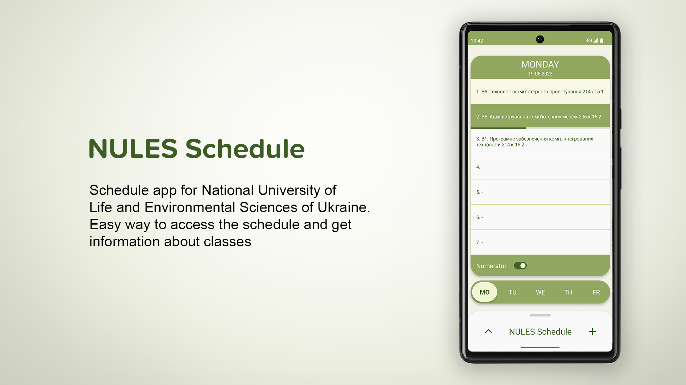
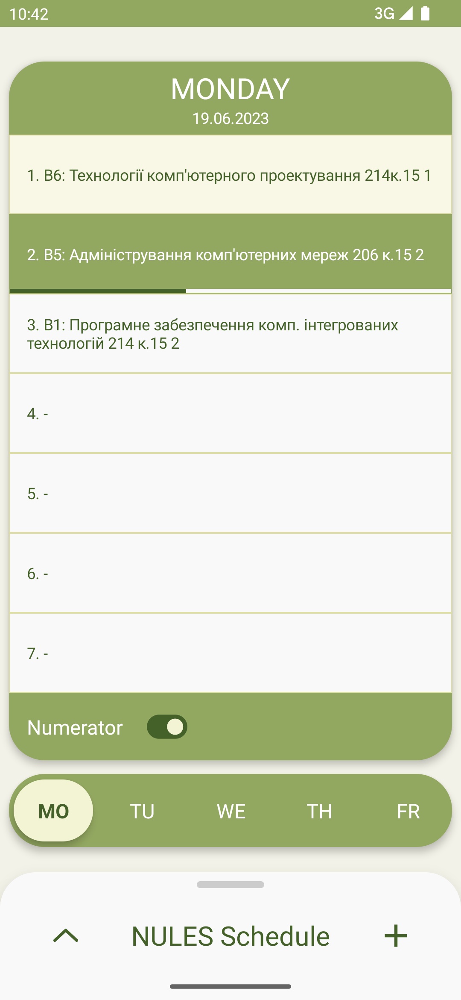
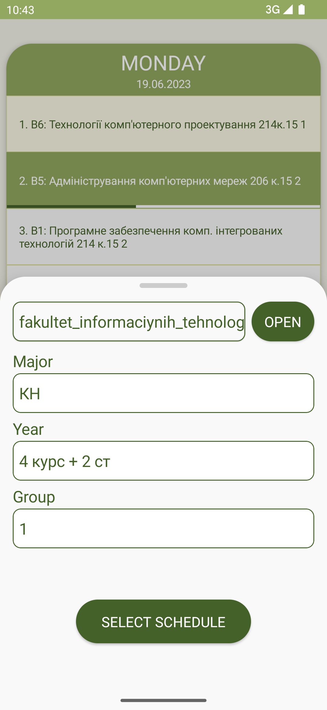
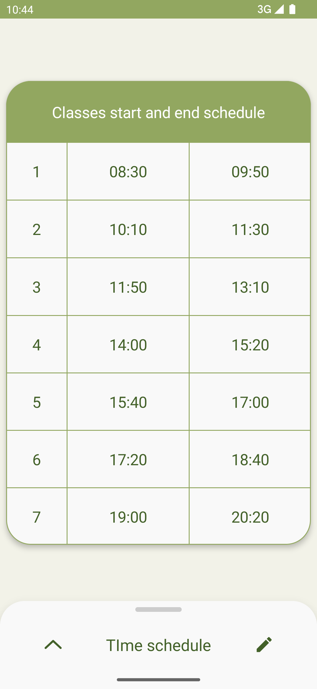
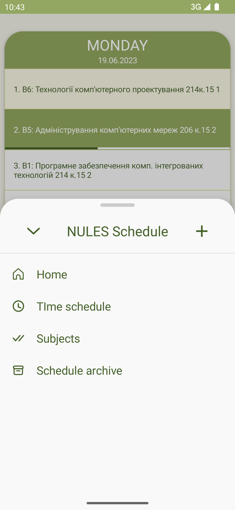
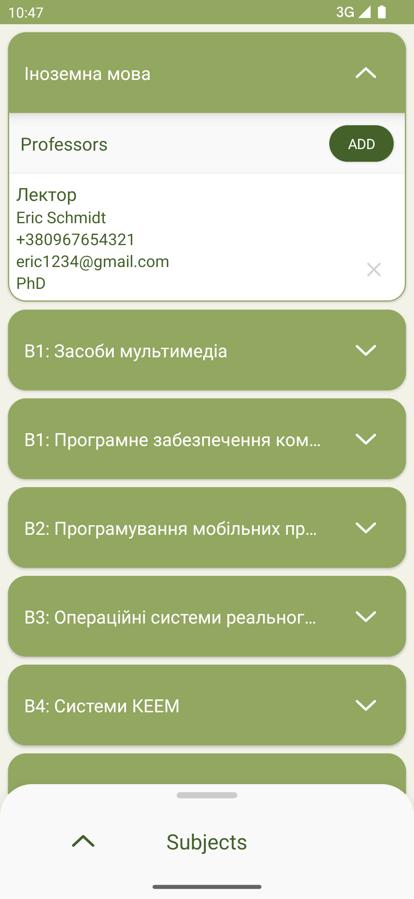
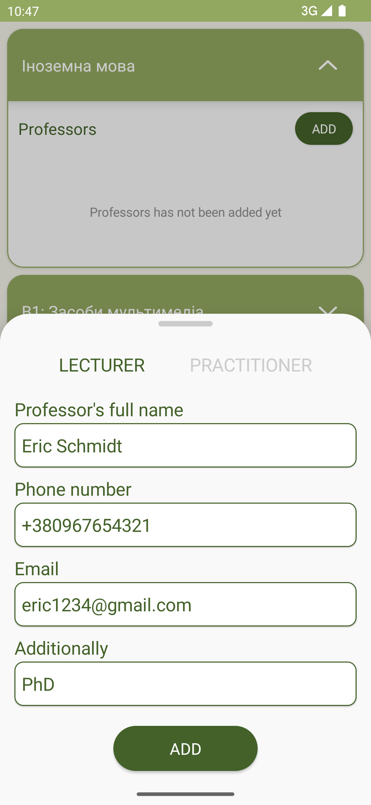
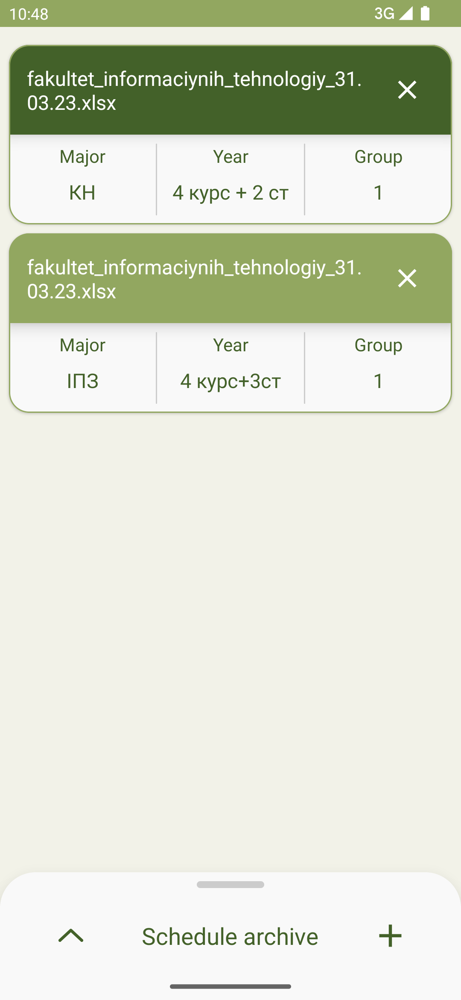

# NULES(НУБіП) Schedule
Improved version of schedule app for my university. App parses Excel spreadsheet file with all schedules of the faculty and allows
to select and display needed schedule. It also allows to manage few different schedules and time schedule of the classes.

[](LICENSE)

## Features
- Parsing Excel spreadsheet and displying needed schedule
- Saving few schedules at once
- Time schedule management
- Displaying current class and it's progress
- Saving information about professors for each subject

## Overview
### Schedule screen
 

### Time schedule and navigation
 

### Subjects screen
 

### Archive screen


## Technologies used
- [Kotlin](https://kotlinlang.org/)
- MVVM Architecture pattern
- [Room](https://developer.android.com/training/data-storage/room) local database
- [Dagger-hilt](https://dagger.dev/hilt/) for dependency injection
- [Jetpack Compose](https://developer.android.com/jetpack/compose) for the UI
- [Compose Navigation](https://developer.android.com/jetpack/compose/navigation)
- [Accompanist libraries](https://google.github.io/accompanist/) for UI components which are not yet available in default Jetpack Compose collection
- [Data store](https://developer.android.com/topic/libraries/architecture/datastore) for saving preferences
- [Apache POI](https://poi.apache.org/) Java library for working with Excel files

## License
```  
MIT License

Copyright (c) 2023 Bohdan Deryha

Permission is hereby granted, free of charge, to any person obtaining a copy
of this software and associated documentation files (the "Software"), to deal
in the Software without restriction, including without limitation the rights
to use, copy, modify, merge, publish, distribute, sublicense, and/or sell
copies of the Software, and to permit persons to whom the Software is
furnished to do so, subject to the following conditions:

The above copyright notice and this permission notice shall be included in all
copies or substantial portions of the Software.

THE SOFTWARE IS PROVIDED "AS IS", WITHOUT WARRANTY OF ANY KIND, EXPRESS OR
IMPLIED, INCLUDING BUT NOT LIMITED TO THE WARRANTIES OF MERCHANTABILITY,
FITNESS FOR A PARTICULAR PURPOSE AND NONINFRINGEMENT. IN NO EVENT SHALL THE
AUTHORS OR COPYRIGHT HOLDERS BE LIABLE FOR ANY CLAIM, DAMAGES OR OTHER
LIABILITY, WHETHER IN AN ACTION OF CONTRACT, TORT OR OTHERWISE, ARISING FROM,
OUT OF OR IN CONNECTION WITH THE SOFTWARE OR THE USE OR OTHER DEALINGS IN THE
SOFTWARE.
```  
